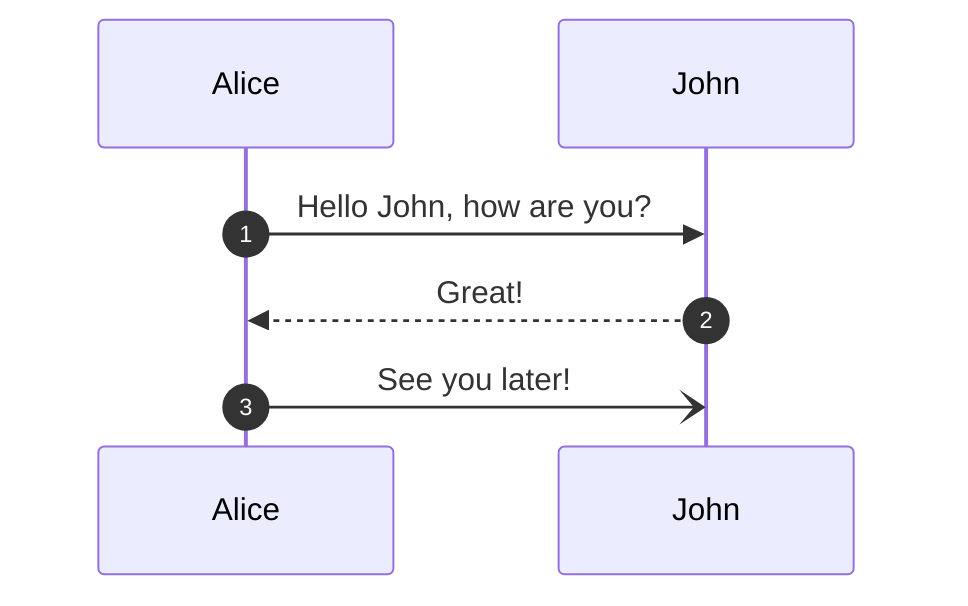

In th elast 6 months I've started to use **Mermaid JS** to draft integration designs as well as document implemented integration applications. There is a lot of support for this tool, however, it's not supported natively as part of **GitHub Pages**. In this post I'll introduce what Mermaid is, some of the benefits and how to add support for GitHub Pages, specifically the **Minimal Mistakes** theme.

## What is Mermaid JS?

**[Mermaid JS](https://mermaid.js.org)** is a **JavaScript based** tool for rendering a variety of diagrams styles using a **Markdown-style** syntax. Some of the supported diagrams include:

- [Flow Chart](https://mermaid.js.org/syntax/flowchart.html)
- [Sequence Diagram](https://mermaid.js.org/syntax/sequenceDiagram.html)
- [Gantt Chart](https://mermaid.js.org/syntax/gantt.html)

An example sequence diagram could be defined using:

``` text
sequenceDiagram
autonumber
  Alice->>John: Hello John, how are you?
  John-->>Alice: Great!
  Alice-)John: See you later!
```

This produces the below diagram:



With being **test-based**, Mermaid diagrams benefit from being able to quickly and easily design simple and beautiful diagrams. These diagrams can also be updated far quicker than typical diagramming tools, such as **[Draw.IO](https://www.drawio.com/)** and **[MS Visio](https://www.microsoft.com/en-gb/microsoft-365/visio/flowchart-software)** (These are still great tools and useful for long-term documentation), without needing to export an updated copy of the diagram and can evolve as a project design iterates. Also, being text-based, **source control** can be used to collaborate and version-control these diagrams.

This tool has been widely accepted and embraced, so much so that the number of tools that has **[integrated Mermaid JS](https://mermaid.js.org/ecosystem/integrations.html)** either natively, or 3rd party extensions is very extensive.

## Adding Support

There are 2 main aspects to adding support for Mermaid to Minimal Mistakes:

1. Adding the Mermaid asset
2. Customising the rendered HTML blocks

Minimal Mistakes is a highly configurable **[GitHub Pages remote theme](https://mmistakes.github.io/minimal-mistakes/docs/quick-start-guide)** which provides great templates and functionality for static sites, such as this blog, allowing me to focus on the content not UI design. One customisation feature is the ability to **[include your own scripts](https://mmistakes.github.io/minimal-mistakes/docs/javascript/#customizing)**, such as Mermaid.

``` yaml
after_footer_scripts:
  - https://cdn.jsdelivr.net/npm/mermaid@9.4.3/dist/mermaid.js
```

This adds the CDN packaged version of Mermaid JS to the generated Jekyll site. Typically, Mermaid Diagrams are added to Markdown files using the codesyntax `\`\`\` mermaid`
