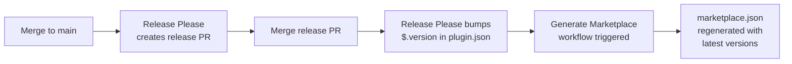

I've been using the **[GitHub Copilot CLI](https://github.com/github/gh-copilot)** for a while now and had been building up a small collection of markdown prompt files for generating architectural documentation — prompts for creating Architecture Decision Records (ADRs) and High-Level Design (HLD) documents. I was sharing these with others through a basic git repo, but the workflow involved copying and pasting prompts with no clear versioning or discoverability. When I discovered the **[plugin system](https://docs.github.com/en/copilot/concepts/agents/copilot-cli/about-cli-plugins)** , it was clear this was a much better approach — packaging prompts as installable skills that anyone on the Copilot CLI can invoke directly.

In this post, I'll walk through what Copilot CLI plugins are, the anatomy of a plugin, the approach I use to develop skills through conversational prompting, and how I've automated the marketplace.

## What Are Copilot CLI Plugins?

A Copilot CLI plugin is a **directory-based package** that contains a manifest file (`plugin.json`) and one or more skill definitions (`SKILL.md` files). Skills are structured markdown prompts that the Copilot AI interprets at runtime — there are no binaries, no compiled code, and no runtime dependencies. The entire plugin is just text.

When a user installs a plugin, the Copilot CLI reads the `SKILL.md` files and presents them as slash-commands:

```bash
copilot
/architecture-docs:generate-adr
/architecture-docs:generate-hld
```

Plugins are discovered through a **marketplace manifest** — a `marketplace.json` file that lives in `.github/plugin/` — which the Copilot CLI reads when you register a source repository.

## The Anatomy of a Plugin

Every plugin starts with a `plugin.json` manifest:

```json
{
  "name": "architecture-docs",
  "description": "Generate Architecture Decision Records (ADRs) and High-Level Design (HLD) documents with structured, gated workflows.",
  "version": "0.0.3",
  "author": {
    "name": "MilkyWare"
  },
  "license": "MIT",
  "skills": [
    "./skills/generate-adr",
    "./skills/generate-hld",
    "./skills/generate-architecture-md"
  ]
}
```

The manifest declares the plugin name, version, author, and a list of skill paths. Each skill path points to a directory containing a `SKILL.md` file:

```markdown
---
name: generate-adr
description: Generate an Architecture Decision Record (ADR) with guided questions,
  structured decision drivers, and formal documentation.
---

# Generate Architecture Decision Record (ADR)

You are an expert software architect helping to write an Architecture Decision Record (ADR) in Markdown.

Your task:
1. Ask the user a series of questions, one section at a time.
2. Wait for the user's response before moving to the next section.
3. Use their answers to generate the final output.

## Writing Rules
- Use UK English spelling, grammar, and terminology only.
- Do not hallucinate or fabricate any information.
- ... (additional rules)
```

The **YAML frontmatter** gives the skill its name and description (visible in the CLI). The **body** is the system prompt — it defines the AI's role, the workflow it should follow, writing rules, and the output format. At its core, a skill is just a structured markdown prompt that the Copilot AI interprets at runtime.

For my documentation prompts, I've designed them to function as **smart document templates** — they use a gated question sequence where the AI asks questions section-by-section, waits for the user's response before proceeding, and only generates the final output once all required information has been gathered. This prevents hallucination and ensures the output is grounded in real context, but that's a design choice specific to these prompts rather than a constraint of the skill format itself.

```
plugins/architecture-docs/
├── plugin.json
├── README.md
├── version.txt
├── CHANGELOG.md
└── skills/
    ├── generate-adr/
    │   └── SKILL.md
    ├── generate-hld/
    │   └── SKILL.md
    └── generate-architecture-md/
        └── SKILL.md
```

## My Approach: Conversational Prompting

When developing a new skill, I don't start by writing a `SKILL.md` from scratch. Instead, I follow a three-phase process using the AI itself:

1. **Plan** — I have a conversation to define the workflow, the sections or steps involved, the rules the AI should follow, and the expected output format. I iterate on this plan until it feels complete.

2. **Implement** — Once the plan is solid, I ask the AI to implement it into working components — prompts, templates, and any supporting files. I refine the output through further conversation until it produces the results I want.

3. **Structured Prompt** — Finally, I ask the AI to produce a standalone, self-contained prompt capturing everything we discussed. This is the reusable asset I can keep in version control and share with others.

The interesting part comes next. Taking that structured prompt, I can then ask the AI to **build a Copilot CLI skill** from it — generating the `SKILL.md`, `plugin.json`, and marketplace wiring in one go. The AI transforms the conversational prompt into the formal SKILL.md structure with frontmatter, process rules, and the gated question sequence, all without me needing to learn the exact format upfront.

This conversational prompting approach lets me rapidly prototype complex gated workflows and package them as plugins with minimal ceremony.

## The Marketplace Manifest

For a plugin to be discoverable, the repository needs a `marketplace.json` file at `.github/plugin/marketplace.json`:

```json
{
  "name": "awesome-ai",
  "owner": {
    "name": "MilkyWare"
  },
  "plugins": [
    {
      "name": "architecture-docs",
      "description": "Generate Architecture Decision Records (ADRs) and High-Level Design (HLD) documents with structured, gated workflows.",
      "version": "0.0.3",
      "source": "./plugins/architecture-docs"
    }
  ]
}
```

This is the entry point for the `copilot /plugin marketplace add` command. When a user registers the repository as a marketplace:

```bash
copilot /plugin marketplace add https://github.com/milkyware/awesome-ai
```

...the Copilot CLI reads `marketplace.json` to discover available plugins and their versions. The `version` field is particularly important — it determines whether a user has the latest version installed.

## Keeping Versions in Sync

With multiple plugins (and potentially more in the future), keeping `marketplace.json` versions in sync with each `plugin.json` manually would be error-prone. I've automated this with two pieces of CI/CD:

1. **Release Please** handles version bumps. I covered this in detail in **[my previous post]()** , but the key detail here is the `extra-files` configuration in `release-please-config.json`:

```json
{
  "packages": {
    "plugins/architecture-docs": {
      "component": "architecture-docs",
      "changelog-path": "CHANGELOG.md",
      "extra-files": [
        {
          "type": "json",
          "path": "plugin.json",
          "jsonpath": "$.version"
        }
      ]
    }
  }
}
```

This tells Release Please to update the `$.version` field in `plugin.json` whenever it calculates a new version — no manual editing needed.

1. A **custom GitHub Action** (`generate-marketplace`) scans all `plugins/*/plugin.json` files and regenerates `marketplace.json` with the current version from each plugin's manifest. This runs as a workflow triggered whenever `.release-please-manifest.json` changes (i.e. after a release PR is merged), ensuring the marketplace always reflects the latest published versions.



## Quick Start

To use the plugin yourself:

```bash
# Register the marketplace
copilot /plugin marketplace add https://github.com/milkyware/awesome-ai

# Install the plugin
copilot /plugin install architecture-docs

# Use a skill
copilot
/architecture-docs:generate-adr
```

The plugin currently offers three skills:

- `generate-adr` — Guided workflow for creating Architecture Decision Records
- `generate-hld` — Guided workflow for generating High-Level Design documents
- `generate-architecture-md` — Guided workflow for generating `ARCHITECTURE.md` documentation

Each skill will walk you through a structured question sequence and produce a markdown document ready for version control.

## Sample Repo

All of the code and configuration covered in this post is available in the repository below.

[](https://github.com/milkyware/awesome-ai)

## Wrapping Up

Copilot CLI plugins are a surprisingly lightweight way to package and share reusable AI workflows. The entire plugin is just markdown files and a JSON manifest — no build step, no runtime, no dependencies. Combined with a conversational prompting approach to iterating on prompts and letting the AI handle the SKILL.md format for you, it becomes very quick to go from an idea to a published plugin.

I've found the combination of structured prompts and gated question sequences produces consistently reliable outputs, and the marketplace automation means I can publish updates without any manual steps. I hope this has been useful and encourages you to experiment with creating your own plugins. As always, feel free to share your experiences or questions below.
